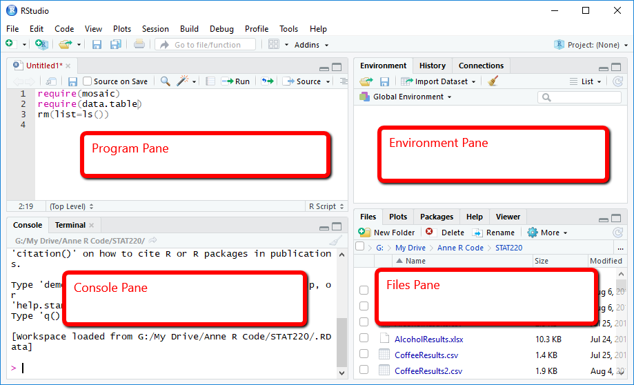

```{r setup, include=FALSE}
knitr::opts_chunk$set(echo = TRUE)
library(tidyverse)
```

# Installing R and RStudio

**Before Section**

Download and install **BOTH** R and RStudio. Visit the following links and download the latest version of R and RStudio suitable for your operating system.

-   To download R, visit https://cloud.r-project.org/
-   Install R
-   To download RStudio, visit https://posit.co/download/rstudio-desktop/#download
-   Install RStudio
-   Screenshots are available at https://bcourses.berkeley.edu/files/90752389/download?download_frd=1
-   To learn more about R and RStudio, visit https://rstudio-education.github.io/hopr/starting.html

# Rstudio

**Before Section**

-   Watch video (5min): https://www.youtube.com/watch?v=FIrsOBy5k58



**Check after section**

- [ ] know what each pane in RStudio is for  
  - (top-left) program pane where you write codes
  - (bottom-left) console pane where you see the codes you executed and their corresponding results
  - (top-right) environment pane that shows objects you created
  - (bottom-right) files pane that shows files, plots, help, and packages
- [ ] know how to create and save an R script
- [ ] know how to execute an R code

# R

## R Objects

You can create an R object by using `<-`.

```{r}
a <- 1
print(a)
```
Do you see the object `a` in your environment pane?

You can remove object(s) by using `rm`.
```{r}
rm(a)
```

If you would like to clear your environment (i.e., remove all objects you created), type `rm(list=ls())`

## Working Directory

You can check your current working directory by typing `getwd()` and set your working directory by using `setwd(<YOUR PATH>)`
```{r}
getwd()
```

```{r, eval=F}
setwd("C:/Users/shuoy/Dropbox/EEP161/Sections/Section1")
```
## Comments

You can write comments in your R script by typing `#` before your comment. R will skip executing the lines starting with `#`. For example,

```{r}
a <- 2
# a <- 1
print(a)
```

## Variable Types

R has several basic variable types (or classes) that are commonly used in programming and data analysis. Understanding these types is crucial for working with data effectively.
- Numeric: Represents numbers (e.g., 42, 3.14).
- Character: Represents text or strings (e.g., "hello").
- Logical: Represents `TRUE` or `FALSE` values.
- Integer: Whole numbers specified with `L` (e.g., 10L).
- Factor: Categorical data stored as levels.
- Complex: Numbers with imaginary parts (e.g., 1 + 2i).

```{r}
# Create variables
num <- 3.14         # Numeric
txt <- "hello"      # Character
flag <- TRUE        # Logical
int <- 10L          # Integer
category <- factor(c("A", "B", "A"))  # Factor

# Check their types
class(num)          # "numeric"
class(txt)          # "character"
class(flag)         # "logical"
class(int)          # "integer"
class(category)     # "factor"

# Use is.* functions
is.numeric(num)     # TRUE
is.character(txt)   # TRUE
is.logical(flag)    # TRUE
```

Convert between types as needed.
```{r}
num <- as.numeric("42")   # Convert character to numeric
text <- as.character(42)  # Convert numeric to character
```

## Simple Calculations

R can be used like a calculator to perform basic arithmetic operations. Simply type the operation into the console and press Enter to see the result.

```{r}
# Basic arithmetic operations
2 + 3       # Addition
10 - 4      # Subtraction
5 * 6       # Multiplication
20 / 4      # Division
2^3         # Exponentiation (2 raised to the power of 3)
sqrt(16)    # Square root
```

R follows the standard order of operations (parentheses, exponents, multiplication/division, and addition/subtraction). You can use parentheses to make your calculations clear and precise.

```{r}
# Using parentheses for clarity
(2 + 3) * 4
```

Certain operations only work on specific types.

```{r, eval = FALSE}
"text" + 1  # Error: non-numeric argument
```

## Vectors

A **vector** is a collection of elements of the same type (e.g., numbers, characters, or logical values). You can create a vector using the `c()` function, which stands for "combine" or "concatenate."

```{r}
# Numeric vector
yields <- c(7.5, 4.2, 3.8)

# Character vector
crops <- c("corn", "wheat", "soybean")

# Logical vector
is_large_field <- c(TRUE, FALSE, TRUE)

# Print vectors
print(yields)
print(crops)
print(is_large_field)
```

You can access individual elements in a vector using square brackets (`[]`). R uses 1-based indexing, meaning the first element is at position 1.

```{r}
# Accessing vector elements
yields[1]   # First element of yields
crops[3]    # Third element of crops
```

You can perform operations on entire vectors, and R will apply the operation to each element.

```{r}
# Vectorized operations
yields + 1              # Add 1 to each yield
yields * 2              # Multiply each yield by 2
yields > 4              # Check which yields are greater than 4
```

## Data Frames

A **data frame** is a table where each column is a vector, and all columns have the same number of elements. It’s one of the most common data structures in R for organizing and analyzing data.

You can create a data frame using the `data.frame()` function.

```{r}
# Creating a data frame
data <- data.frame(
  Crop = crops,
  Yield = yields,
  LargeField = is_large_field
)

# Print the data frame
print(data)
```

You can access specific rows, columns, or individual elements in a data frame using the `$` operator or square brackets (`[ , ]`).

```{r}
# Access a column
data$Yield

# Access specific rows and columns
data[1, ]    # First row
data[, 2]    # Second column
data[1, 2]   # Element in the first row and second column
```

You can also view the structure and summary of a data frame.

```{r}
# View structure and summary
str(data)
summary(data)
```

**Check after section**

- [ ] know how to create and remove an object
- [ ] know how to check and set a working directory
- [ ] know how to comment by using `#` in R script
- [ ] know how to distinguish between different variable type
- [ ] know how to conduct basic calculations
- [ ] know how to work with vectors and data frames

# Package

A package bundles together code, data, documentation, and tests, and is easy to share with others. You can install package using `install.package("some_pacakage")`. Note that you need double quote the package name you want to install. Once installed, you can load package by typing `library(some_package)`. In this case, you do not need to double quote. See

```{r,eval=F}
install.packages("tidyverse")
library(tidyverse)
```

## `tidyverse` package

One package that we are going to frequently use is `tidyverse`. `install.packages("tidyverse")` will install the following packages: 

```{r, echo=F}
tidyverse_packages(include_self = F)
```

The `tidyverse` is a collection of R packages designed for data science. It provides a cohesive and consistent approach to importing, tidying, transforming, visualizing, and modeling data. These packages share an underlying philosophy and grammar of data manipulation and visualization. Key features include:

- Consistent syntax and integrated packages: Functions in the tidyverse use a consistent structure, making it easy to learn and use.
- Pipe operator (`%>%`): Allows chaining commands together in a readable and efficient way.
- Core `tidyverse` packages: `ggplot2` for data visualization based on the grammar of graphics. `dplyr` for data manipulation, such as filtering, summarizing, and transforming. `tidyr` for tidying messy data, such as reshaping data frames. `readr` for reading rectangular data (like CSV files) into R. `stringr` for string manipulation. Additional tools like `purrr` for functional programming and `forcats` for handling categorical data enhance its versatility.

## Pipe Operator (`%>%`)
The pipe operator takes the output of one function and uses it as the input for the next function. This eliminates the need to write intermediate variables or nested function calls, simplifying your workflow.

```{r}
# Without pipes (base R):
filtered <- data[data$Yield > 4, ]
AvgYield <- mean(filtered$Yield)
print(data.frame(AvgYield = AvgYield))

# With pipes:
data %>%
  filter(Yield > 4) %>%
  summarize(AvgYield = mean(Yield)) %>%
  print()
```

**Check after section**

- [ ] know how to install by using `install.package` and load package `library`
- [ ] know what `tidyverse` package is.
- [ ] know how to use pipe operator.


# Working with Data

Let's load a dataset. 

```{r}
Daily_price <- read.csv("DailyPrices.csv")
```


You can check first several rows by using `head`. 
```{r}
head(Daily_price)
```

If you want to see all rows and columns, use `View()` or click the object in the environment pane.
```{r}
View(Daily_price)
```

We can do a quick summary of data by using `summary`.
```{r}
summary(Daily_price)
```